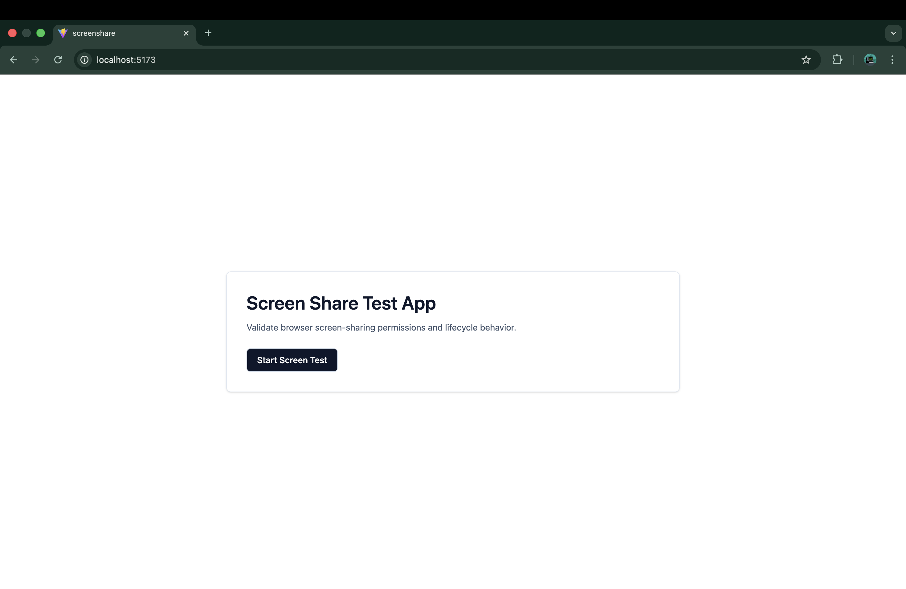
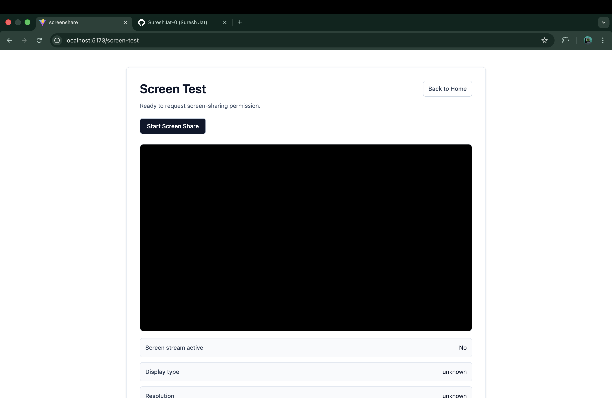
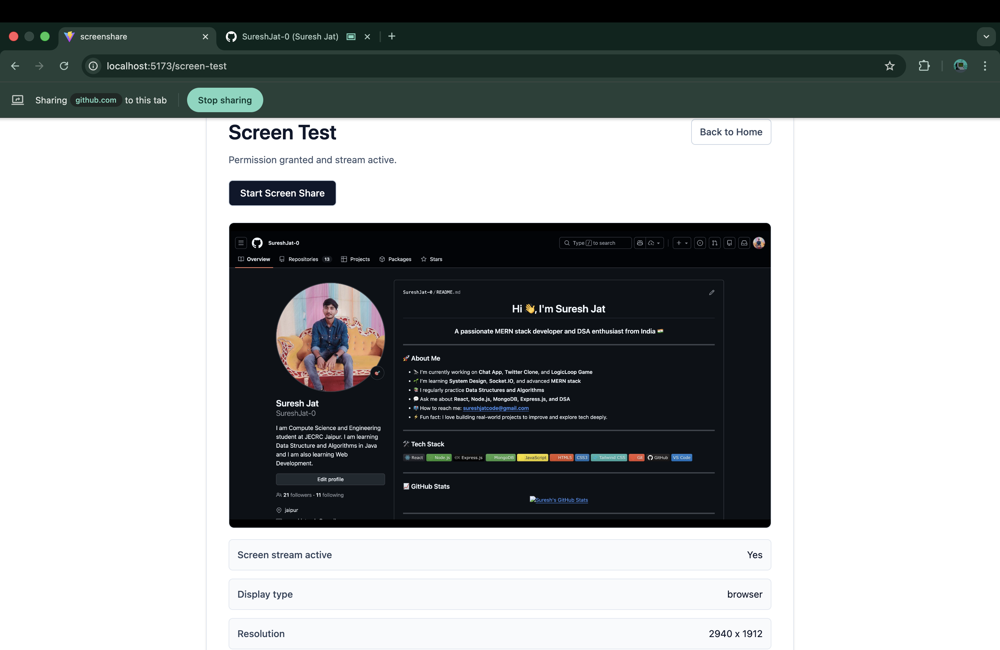

# Screen Share Test App

A React + Vite application to test browser screen-sharing support, permission handling, and stream lifecycle states.

## Setup Instructions

### Prerequisites

- Node.js 18+ (recommended: latest LTS)
- npm 9+
- Desktop browser with `getDisplayMedia` support (Chrome/Edge recommended)

### Install and Run

```bash
npm install
npm run dev
```

Then open the local URL shown by Vite (usually `http://localhost:5173`).

### Build for Production

```bash
npm run build
npm run preview
```

## Screen-Sharing Flow

1. Open `/` (Home page).
2. Click **Start Screen Test**.
3. App checks browser support for `navigator.mediaDevices.getDisplayMedia`.
4. If supported, you are navigated to `/screen-test`.
5. Click **Start Screen Share** to open the browser picker.
6. Choose a tab/window/screen and grant permission.
7. The selected stream is rendered in the video preview.
8. Metadata updates:
	- Display type (`displaySurface`)
	- Resolution (`width x height`)
9. If sharing ends (manually or by browser), status changes to `stopped` and retry is offered.

### Status States

- `idle`: Ready to request permission
- `requesting`: Browser picker is opening
- `granted`: Stream active and visible
- `cancelled`: Picker closed without selection
- `denied`: Permission denied
- `unsupported`: Browser does not support screen sharing
- `unknown`: Other runtime error
- `stopped`: Stream ended after being active

## Screenshots

### Home Screen



### Permission / Screen Test Screen



### Active Share / Result State



## Known Limitations and Browser Quirks

- Screen sharing typically works only in secure contexts (`https`) or `localhost`.
- Mobile browsers often have partial or no support for `getDisplayMedia`.
- Safari support can differ by version and may have stricter behavior than Chromium browsers.
- The app currently requests video only (`audio: false`), so system/tab audio is not captured.
- Resolution and display type metadata depend on browser-provided track settings and may be unavailable (`unknown`).
- `NotAllowedError`, `AbortError`, and similar browser-specific errors are normalized into UI statuses but exact behavior/messages vary by browser and OS.
